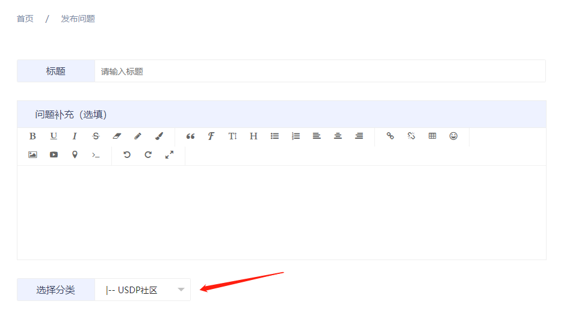

# 社区技术支持

您在使用USDP社区版的过程中碰到的问题，可通过以下方式获取社区官方技术支持。

### Method 1：USDP相关问题查找

请前往  [官方社区问答](https://www.ucloud.cn/yun/ask)  浏览并查找您可能已碰到问题的解决办法。

社区问答讨论区内容较多，可配合使用“搜索”功能来查找感兴趣的问题

### Method 2：提问题

若未查找到您感兴趣的问题及回复，则可通过以下方式进行提问题。

请前往  [官方社区问答-提问题](https://www.ucloud.cn/yun/question/add.html)  登录并提交您的问题。

?> 1. 请详细填写您遇到的问题，必要时可配合截图、粘贴日志等方式辅助说明问题。  2. "**选择分类**"处，请选择 “**USDP社区**”。

